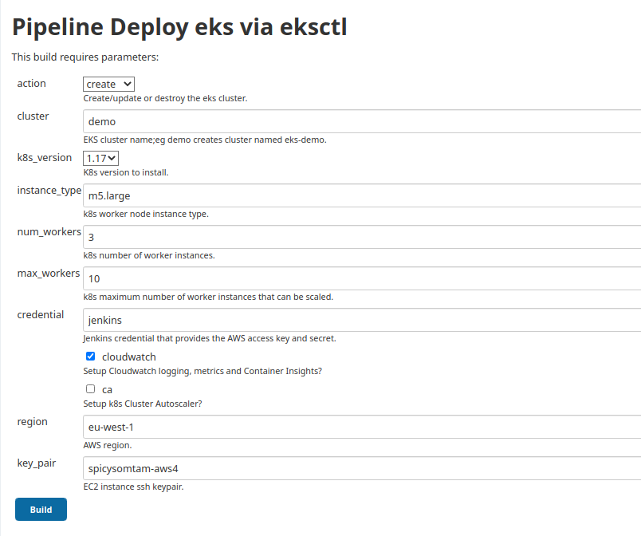

# Introduction

This is an update to my deployment [jenkins-deploy-eks-via-terraform](https://github.com/spicysomtam/jenkins-deploy-eks-via-terraform). Technology moves on, and there are easier ways to do this (remember DevOps is about doing things in a clever, simple way; don't choose the most complex solution!). Please refer to that repo for full details. Anyhow this deploy replaces the deploy via `terraform` with `eksctl`, which is now officially supported by AWS (docs [here](https://docs.aws.amazon.com/eks/latest/userguide/getting-started-eksctl.html)).

The differences between `terraform` and `eksctl`? `terraform` is from Hashicorp and is a tool for building infrastructure for different providers like AWS, GCP, Azure, etc. `eksctl` uses AWS Cloudformation to deploy EKS clusters, and in a simple way creates the vpc, subnets, nodegroups and everything else needed. `eksctl` is a much simpler way to build EKS clusters via Cloudformation.

You can see my notes on Fargate [here](https://github.com/spicysomtam/jenkins-deploy-eks-via-terraform#introduction); at this time Fargate is not a realistic option for EKS, so autoscaling node groups are used instead (EC2 instances).

There are lots of options for `eksctl`; most of this is documented at [eksctl.io](https://eksctl.io), although you might want to issue `--help` against the latest binary to see what options are available.

I kept the Cluster Autoscaler and Cloudwatch logs/metrics/container insights. These all work as per the `terraform` solution.

